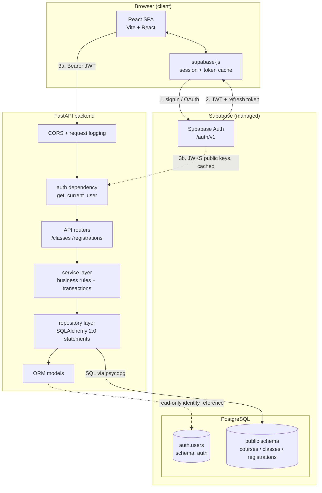
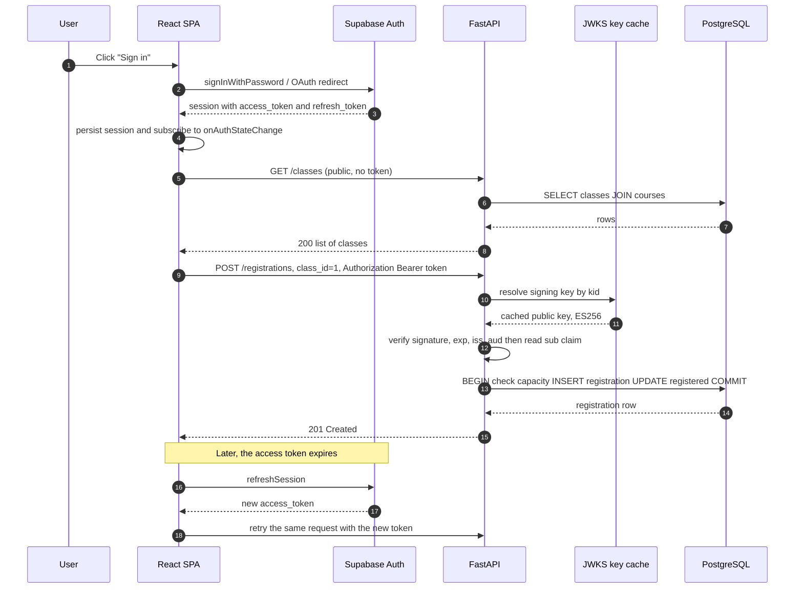
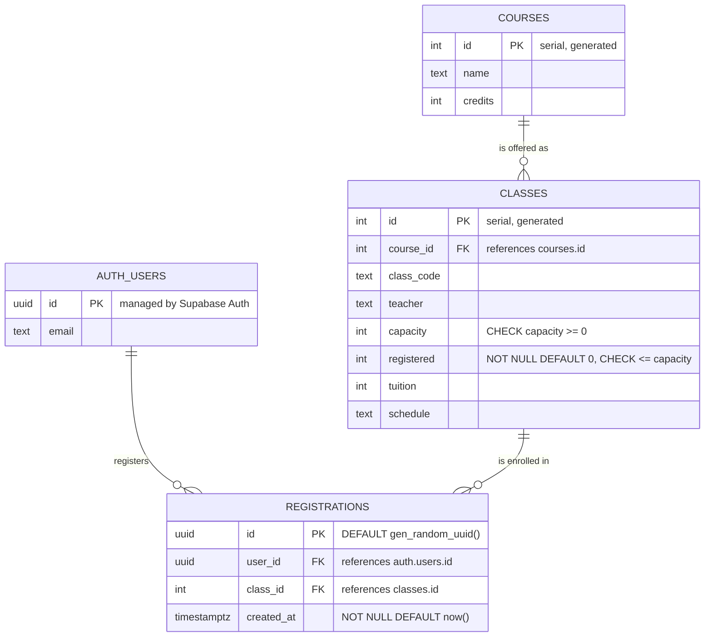
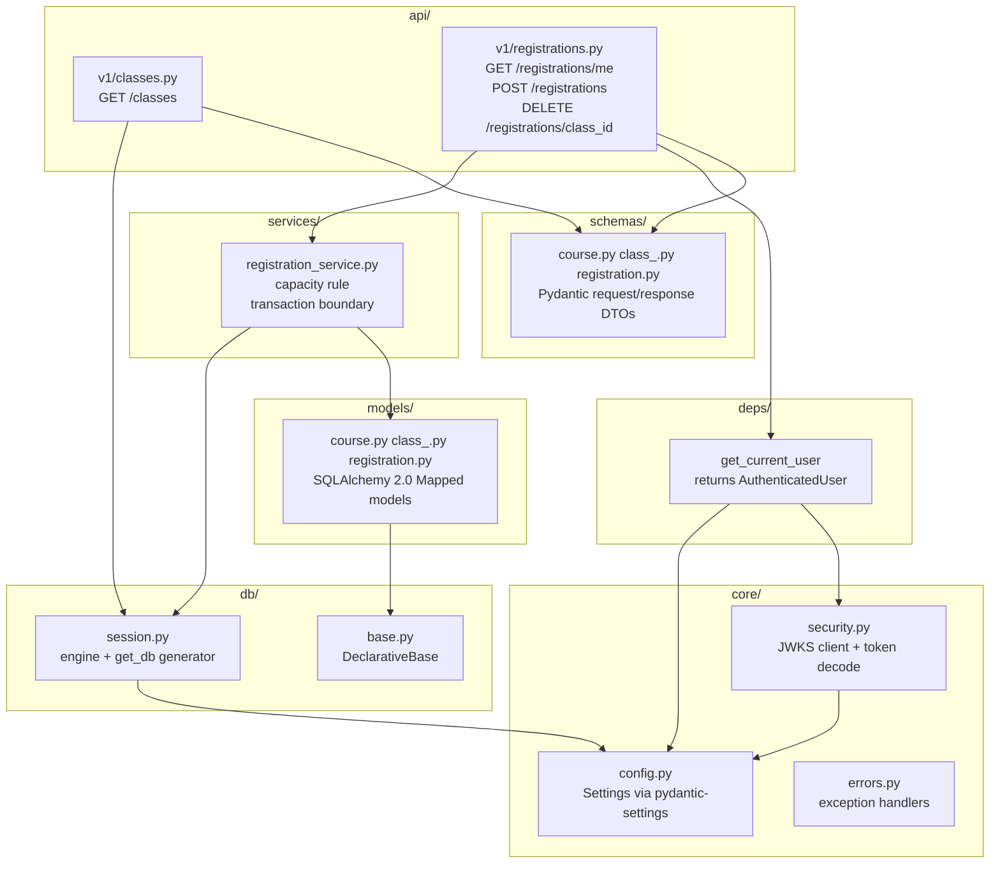
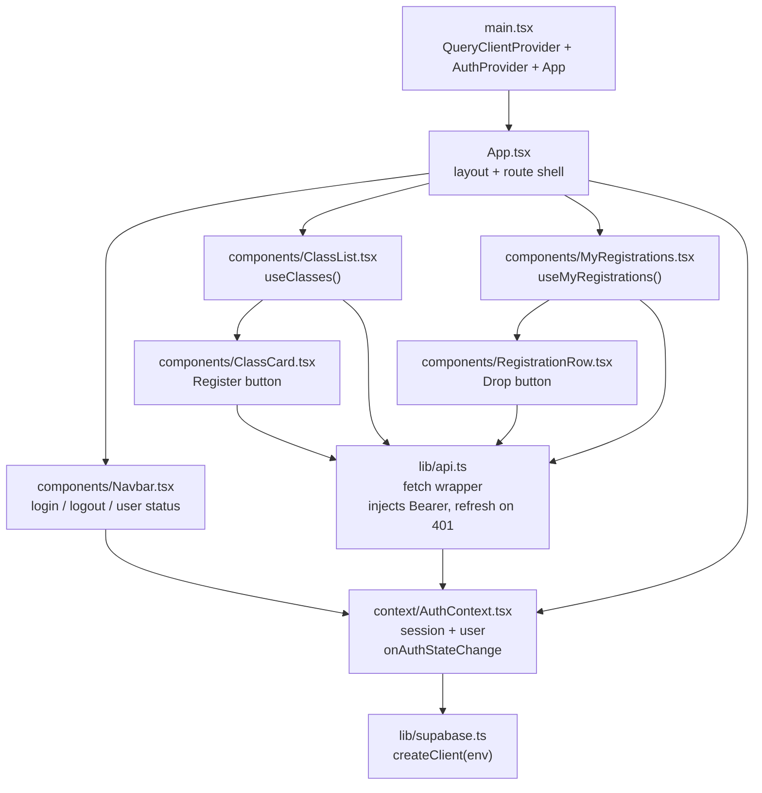

# Architecture — Course Registration App

> Companion documents: [`PRD.md`](./PRD.md) (requirements), [`docs/todos.md`](./docs/todos.md) (implementation plan).
> Scope is **strictly** the student registration flow defined in PRD §3–§6. Teacher-facing CRUD,
> role-based access control, and course/class authoring are **explicitly out of scope** (see §9).

## 1. System Context

The stack is `React (Supabase Client) → FastAPI → SQLAlchemy → PostgreSQL (Supabase)`. There are two
independent hops and it is important not to conflate them:

| Hop          | Direction                    | Purpose                                                                             |
| :-------------| :-----------------------------| :------------------------------------------------------------------------------------|
| **Auth hop** | React ⇄ Supabase Auth        | Establishes identity and returns a signed JWT. FastAPI is *not* involved.           |
| **Data hop** | React → FastAPI → PostgreSQL | FastAPI authorises the request using the JWT, then reads/writes through SQLAlchemy. |



**Reading the diagram.** Steps 1–2 are the auth hop. Step 3a carries the resulting JWT on every
protected data request. Step 3b is how FastAPI verifies that token *offline* — it fetches the project's
public keys once and caches them, so no per-request call to Supabase Auth is required.

---

## 2. Authentication Flow

FastAPI never sees a password and never issues a token. It receives a token that Supabase Auth already
signed and answers one question: *is this token genuine, unexpired, and issued for this project?*

### 2.1 Token verification (primary path — asymmetric keys via JWKS)



### 2.2 What is verified

| Claim     | Verified? | Why                                                                                                                     |
| :----------| :----------| :------------------------------------------------------------------------------------------------------------------------|
| signature | **Yes**   | Proves the token was signed by this Supabase project.                                                                   |
| `exp`     | **Yes**   | Rejects expired access tokens.                                                                                          |
| `iss`     | **Yes**   | Must equal `https://<project-ref>.supabase.co/auth/v1`, otherwise a token from a *different* project would be accepted. |
| `aud`     | **Yes**   | Expected value is `authenticated`. A `service_role` token must not be usable for user-facing routes.                    |
| `sub`     | Extracted | The `auth.users.id` UUID. This becomes `user_id` for every registration operation.                                      |
| `role`    | Not used  | Supabase's Postgres role, meaningful for RLS. RLS is disabled here (ADR-2), so FastAPI enforces authorisation instead.  |

### 2.3 Failure behaviour

| Situation | Response |
| :--- | :--- |
| Missing `Authorization` header | `401` with `WWW-Authenticate: Bearer` |
| Malformed / bad signature / wrong `iss` / wrong `aud` | `401` |
| Expired token | `401` — the client refreshes the session and retries once |
| Valid token, but referenced `class_id` does not exist | `404` |
| Valid token, class is full | `409` |

The frontend wrapper in `lib/api.ts` centralises this: on any `401` it calls `supabase.auth.refreshSession()`
exactly once and replays the request; a second `401` surfaces as a login prompt.

---
## 3. Data Model and Table Relationships

There are three application tables plus one Supabase-managed table. The entire schema is
**`courses` → `classes` → `registrations`**, with `registrations` acting as the junction that connects
a Supabase user to a class.

### 3.1 Entity relationship diagram



> **Schema note.** `AUTH_USERS` lives in the `auth` schema owned by Supabase; the three application
> tables live in `public`. Mermaid cannot draw a schema boundary inside an `erDiagram`, so the table
> is named `AUTH_USERS` here purely to make the ownership visible. Nothing in the app ever writes to
> `auth.users` — Supabase Auth is the only writer.

### 3.2 Relationship matrix

| # | From → To | Cardinality | FK column | On delete | Business meaning |
| :-- | :--- | :--- | :--- | :--- | :--- |
| R1 | `courses` → `classes` | **1 : N** | `classes.course_id` | `RESTRICT` (default) | One course is offered as many classes (sections). Every class belongs to exactly one course. |
| R2 | `classes` → `registrations` | **1 : N** | `registrations.class_id` | `CASCADE` | One class has many registrations. Every registration targets exactly one class. |
| R3 | `auth.users` → `registrations` | **1 : N** | `registrations.user_id` | `CASCADE` | One user has many registrations. Every registration belongs to exactly one user. |

**Derived many-to-many.** Composing R2 and R3 gives the relationship the app actually exposes:

> **`auth.users` ⟷ `classes` is many-to-many, resolved by the `registrations` junction table.**
> A user may register for many classes; a class may be taken by many users. The junction carries the
> edge attributes (`created_at`) and the uniqueness rule that makes an edge meaningful exactly once.

This is why the PRD calls `registrations` a "junction table" (PRD §3). Note that `registrations` is a
*pure* junction — it has no payload beyond `created_at`, so no surrogate `id` would strictly be needed.
ADR-1 keeps the surrogate primary key because it makes `DELETE` and future extensions simpler.

---
### 3.3 Constraints and indexes (target state)

PRD §3 lists the columns but no constraints. The following are added because the business rules in
PRD §6 cannot be enforced reliably without them:

| Object | Definition | Enforces |
| :--- | :--- | :--- |
| `registrations_user_class_unique` | `UNIQUE (user_id, class_id)` | "a user cannot register for the same class twice" — without this, `POST /registrations` is not idempotent |
| `classes_registered_range` | `CHECK (registered >= 0 AND registered <= capacity)` | rejects overselling and counter drift in one rule |
| `classes_capacity_non_negative` | `CHECK (capacity >= 0)` | rejects nonsense capacity |
| `classes_code_unique` | `UNIQUE (class_code)` | class codes are human-facing identifiers |
| `registrations.user_id` | `FK → auth.users (id) ON DELETE CASCADE` | revoked users leave no orphan rows |
| `ix_classes_course_id` | index on `classes (course_id)` | `GET /classes` joins on this column |
| `ix_registrations_user_id` | index on `registrations (user_id)` | `GET /registrations/me` filters on this column |
| `ix_registrations_class_id` | index on `registrations (class_id)` | unregister + cascade-delete lookups |

### 3.4 DDL sketch

```sql
create table public.courses (
    id      serial primary key,
    name    text    not null,
    credits integer not null check (credits > 0)
);

create table public.classes (
    id         serial primary key,
    course_id  integer not null references public.courses (id) on delete restrict,
    class_code text    not null,
    teacher    text    not null,
    capacity   integer not null check (capacity >= 0),
    registered integer not null default 0,   -- denormalised counter, see ADR-4
    tuition    integer not null default 0,
    schedule   text,
    constraint classes_code_unique unique (class_code),
    constraint classes_registered_range
        check (registered >= 0 and registered <= capacity)
);

create index ix_classes_course_id on public.classes (course_id);

create table public.registrations (
    id         uuid        primary key default gen_random_uuid(),
    user_id    uuid        not null references auth.users (id) on delete cascade,
    class_id   integer     not null references public.classes (id) on delete cascade,
    created_at timestamptz not null default now(),
    constraint registrations_user_class_unique unique (user_id, class_id)
);

create index ix_registrations_user_id  on public.registrations (user_id);
create index ix_registrations_class_id on public.registrations (class_id);
```

---
### 3.5 The `auth.users` boundary — an important subtlety

`registrations.user_id` references a table in a **different schema** that is owned by Supabase Auth.

* **In PostgreSQL**, the foreign key works normally and is worth having: it guarantees every
  registration points at a real user.
* **In SQLAlchemy**, `auth.users` is deliberately **not** mapped as an ORM model. There is no `User`
  class and no `relationship()` across that boundary. `Registration.user_id` is declared as a plain
  `uuid` column.

The reason is ownership: Supabase Auth may change the `auth` schema without notice, and an ORM model
would turn that into a runtime break. Keeping `user_id` as a bare column means the backend treats
identity as an opaque UUID arriving from a verified JWT — exactly what PRD §4 describes when it says
FastAPI "extracts `user_id` (sub) from the token payload and uses it for database operations."

The cost of this choice: `GET /registrations/me` cannot join `auth.users` to return the user's email.
The frontend already holds that value in its Supabase session, so no join is required.

### 3.6 Write paths and concurrency

Both mutations touch **two tables at once**, so each runs inside a single transaction. `classes.registered`
is a denormalised counter (ADR-4), which means concurrent registrations for the same class can lose
updates if read-then-write is done naively. The rule is: **never compute the new counter in Python.**

| Operation | Transaction steps |
| :--- | :--- |
| **Register** — `POST /registrations` | `BEGIN` → `SELECT ... FOR UPDATE` the class row (serialises concurrent attempts on that class) → `404` if absent, `409` if `registered >= capacity` → `INSERT INTO registrations` (rely on the unique constraint for duplicates) → `UPDATE classes SET registered = registered + 1` → `COMMIT`. On unique-violation, roll back and return `409`. |
| **Drop** — `DELETE /registrations/{class_id}` | `BEGIN` → delete the registration row, checking the row count → `404` if no row matched → if a row was deleted, `UPDATE classes SET registered = registered - 1` → `COMMIT`. |

`UPDATE ... SET registered = registered + 1` is a single atomic statement evaluated by the database, so
no lost-update anomaly occurs. `SELECT ... FOR UPDATE` additionally makes the capacity check safe against
two simultaneous requests both observing a free seat. The `CHECK (registered <= capacity)` constraint is
the final backstop: if the lock is ever omitted, the transaction fails loudly instead of overselling.

The alternative — deriving the count with `SELECT COUNT(*) FROM registrations WHERE class_id = ?` — is
more correct by construction and is recorded as ADR-4's alternative, but the PRD explicitly requires the
`registered` column, so this design honours it while making it safe.

---
## 4. Backend Target Structure

The backend package uses a uv src-layout at `backend/src/backend/` and targets Python 3.14. The current
package contains only a placeholder `__init__.py`; `main.py`, the database layer, API, migrations, and
services described here have not been implemented. `backend/pyproject.toml` declares part of the target
dependency set; the setup guide tracks the remaining packages.

### 4.1 Layer responsibilities



### 4.2 Modules and why each exists

| Module | Contents | Notes |
| :--- | :--- | :--- |
| `main.py` | `FastAPI()` app, CORS middleware, router mounting, lifespan that warms the JWKS cache | The `backend:main` script entry point in `pyproject.toml` should resolve here |
| `core/config.py` | `Settings(BaseSettings)`: `database_url`, `supabase_url`, `supabase_jwt_secret`, `supabase_jwt_audience`, `cors_origins` | Read from `.env`; no secrets in code |
| `core/security.py` | `PyJWKClient` wrapper, `decode_token(token) -> Claims` | The single place JWT logic lives (ADR-3) |
| `deps/auth.py` | `get_current_user` FastAPI dependency + `AuthenticatedUser` (`id: UUID`) | Turns a raw header into a trusted identity |
| `db/base.py` | `class Base(DeclarativeBase)` | Shared metadata for Alembic autogenerate |
| `db/session.py` | `create_engine(...)`, `SessionLocal`, `get_db()` yielding a `Session` | Injected into routes and services |
| `models/*.py` | `Course`, `Class`, `Registration` | `Course.classes` / `Class.registrations` use `relationship()`; `Registration.user_id` does **not** (§3.5) |
| `schemas/*.py` | `ClassOut` (incl. nested `CourseOut`), `RegistrationCreate`, `RegistrationOut` | Never expose ORM objects directly |
| `services/registration_service.py` | `register(session, user_id, class_id)`, `unregister(session, user_id, class_id)` | Owns the transaction described in §3.6 |
| `api/v1/*.py` | Thin routers: parse → call dependency → call service → return schema | No SQL and no business rules here |

The layering rule is one-directional: **routers → services → models/db**. Routers never import
`models` for querying and services never import `fastapi.Request`. This keeps the capacity rule testable
without an HTTP client, which `docs/todos.md` Phase 8 depends on.

---
## 5. Frontend Target Structure

The current `frontend/` directory is the default Vite + React + TypeScript starter. The component tree
below is the proposed implementation of PRD §5 (`App → Navbar / ClassList / MyRegistrations`). It is not
present in the source yet. The design places Supabase session state in a context so the data components
can react to login and logout without passing the token through each component.



| File | Responsibility |
| :--- | :--- |
| `lib/supabase.ts` | The single `createClient` instance, configured from `VITE_SUPABASE_URL` and `VITE_SUPABASE_ANON_KEY` |
| `context/AuthContext.tsx` | Subscribes to `supabase.auth.onAuthStateChange`, exposes `{ session, user, signIn, signOut }` |
| `lib/api.ts` | Reads the current access token, attaches `Authorization: Bearer`, parses the error envelope, and on `401` refreshes once and retries |
| `components/ClassList.tsx` | `GET /classes` — renders for **anonymous and authenticated** users (PRD §7). Disables "Register" with a tooltip when signed out |
| `components/MyRegistrations.tsx` | `GET /registrations/me` — hidden or replaced with a prompt when signed out |
| `components/Navbar.tsx` | Reflects auth state; hosts the Google/Email sign-in trigger |

Each data component handles four states explicitly — **loading, empty, error, populated** — because the
PRD's "unauthenticated users can view available classes" requirement makes an anonymous empty state a
first-class case rather than an edge case.

---

## 6. API Contract

PRD §4 defines four endpoints. The table below adds the shapes and status codes the implementation and
its tests are written against.

| Method | Endpoint | Auth | Request | Success | Errors |
| :--- | :--- | :--- | :--- | :--- | :--- |
| `GET` | `/classes` | No | — | `200` `[ClassOut]` | `500` |
| `GET` | `/registrations/me` | **Yes** | — | `200` `[RegistrationOut]` | `401`, `500` |
| `POST` | `/registrations` | **Yes** | `{ "class_id": 1 }` | `201` `RegistrationOut` | `401`, `404` class missing, `409` full or duplicate, `422` validation |
| `DELETE` | `/registrations/{class_id}` | **Yes** | path param | `204` no body | `401`, `404` not registered / class missing |

### 6.1 Response shapes

```jsonc
// ClassOut — GET /classes, course inlined so the table renders in one request
{
  "id": 4,
  "class_code": "CS101-02",
  "teacher": "Dr. Nguyen",
  "capacity": 40,
  "registered": 12,
  "tuition": 1500,
  "schedule": "Mon/Wed 09:00-10:30",
  "course": { "id": 1, "name": "Intro to Computer Science", "credits": 3 }
}

// RegistrationOut — GET /registrations/me
{
  "id": "9f1c...",
  "class_id": 4,
  "created_at": "2026-09-24T12:00:00Z",
  "class": { /* ClassOut */ }
}
```

`GET /classes` inlines `course` deliberately: it collapses what would otherwise be an N+1 fetch on the
client and lets the frontend render the catalog from a single request. On the backend this is one query
with `selectinload(Class.course)` (or a `JOIN`), replacing the per-class lazy load.

### 6.2 Error envelope

Every non-2xx response uses the same body so `lib/api.ts` can parse failures uniformly:

```jsonc
{ "detail": "Class 4 is full", "code": "class_full" }
```

`code` is a stable machine-readable string (`invalid_token`, `class_not_found`, `class_full`,
`already_registered`, `registration_not_found`); `detail` is for humans and may be localised later.
Validation errors use FastAPI's default `422` shape, which nests under `detail` — the frontend treats
`422` as a generic "invalid request" and only special-cases the `code` values it knows.

---
## 7. Cross-Cutting Concerns

### 7.1 Configuration and secrets

| Variable | Where | Purpose |
| :--- | :--- | :--- |
| `VITE_SUPABASE_URL` | frontend `.env` | Supabase project URL for `createClient` |
| `VITE_SUPABASE_ANON_KEY` | frontend `.env` | Public key. Safe to ship — **this is the only Supabase key the browser may see.** |
| `VITE_API_BASE_URL` | frontend `.env` | FastAPI origin |
| `DATABASE_URL` | backend `.env` | `postgresql+psycopg://...` pointed at the Supabase connection string |
| `SUPABASE_URL` | backend `.env` | Builds the `iss` check and the JWKS URL |
| `SUPABASE_JWKS_URL` | backend `.env` | Defaults to `<SUPABASE_URL>/auth/v1/.well-known/jwks.json` |
| `SUPABASE_JWT_AUDIENCE` | backend `.env` | Expected `aud`, normally `authenticated` |
| `SUPABASE_JWT_SECRET` | backend `.env` | **Only** for legacy HS256 projects (ADR-3) |
| `CORS_ORIGINS` | backend `.env` | Comma-separated allowlist |

Two rules that are easy to get wrong:

1. **Never put a secret in a `VITE_`-prefixed variable.** Vite inlines every `VITE_*` value into the
   shipped JavaScript bundle, so it is public by definition. Supabase's own JWT documentation calls out
   this exact `NEXT_PUBLIC_` / `VITE_` / `PUBLIC_` prefix trap as a common way shared secrets leak.
2. **`DATABASE_URL` must never reach the browser.** All database access goes through FastAPI, which is
   the whole point of the architecture in PRD §1.

`.env` files are gitignored; `.env.example` files are committed with placeholder values (task T0.2).
Step-by-step instructions for filling them in live in [`docs/supabase-setup.md`](./docs/supabase-setup.md),
[`docs/backend-setup.md`](./docs/backend-setup.md) and [`docs/frontend-setup.md`](./docs/frontend-setup.md).

### 7.2 CORS

The browser will call FastAPI from a different origin (`localhost:5173` → `localhost:8000` in
development), so `CORSMiddleware` is required. It must allow `Authorization` in
`allow_headers`, otherwise the preflight for every protected request fails and the browser reports only
a generic network error. `allow_origins` is driven by `CORS_ORIGINS` rather than `["*"]`, because
`allow_credentials` and a wildcard origin are mutually exclusive.

### 7.3 Where authorisation actually happens

PRD §4 routes all data access through FastAPI, so **Row Level Security is left disabled** on the three
`public` tables (ADR-2). Authorisation is therefore a property of the API layer, not the database:

* Identity comes from a verified JWT (`sub`), never from the request body.
* `POST /registrations` always writes `user_id` from the token — the payload carries only `class_id`,
  so a client cannot register someone else (PRD §4 payload `{"class_id": 1}`).
* `GET /registrations/me` and `DELETE /registrations/{class_id}` are always filtered by the token's
  `user_id`, so they can only ever affect the caller's own rows.

This is a deliberate trade-off: it matches the PRD's teaching goal but means the database is not
independently safe. If the Supabase anon key were ever used for direct PostgREST access, RLS would need
to be enabled and the policies written — noted as a follow-up in §9.

### 7.4 Observability

The minimum useful baseline: a request-ID middleware, a log line per request with method, path, status
and duration, and token-verification failures logged at `WARNING` with the reason (`expired`,
`bad_signature`, `wrong_audience`) but **never** the token itself. Logging a raw JWT is equivalent to
logging a password.

---
## 8. Architecture Decision Records

Each decision below is reversible; the **Alternative** line records what changing your mind would cost.

### ADR-1 — `registrations.id` is a `uuid`

**Context.** PRD §3 offers "`id` (uuid or serial, PK)" without choosing.
**Decision.** `uuid` with `DEFAULT gen_random_uuid()`, using the `pgcrypto` extension that Supabase
enables by default.
**Rationale.** Supabase is UUID-first: `auth.users.id` is a UUID, so no type juggling is needed for
`user_id`. UUIDs are also safe to expose in URLs without leaking row counts, and registration IDs are
returned to the client in `RegistrationOut`.
**Alternative.** `bigserial` — marginally smaller index, but inconsistent with `user_id` and reveals
totals.

### ADR-2 — Row Level Security disabled on `public` tables

**Context.** Supabase tables default to "RLS disabled" but Supabase strongly recommends enabling it.
**Decision.** Keep RLS off for `courses`, `classes`, `registrations`; enforce authorisation in FastAPI.
**Rationale.** PRD §4 makes FastAPI the only data path — every endpoint goes through `get_current_user`.
Enabling RLS would be dead weight because the backend connects with a privileged role that bypasses it,
and writing policies that mirror the API rules would duplicate the same logic in two languages.
**Consequences.** The database is not independently safe. The anon key must not be used for direct
PostgREST access to these tables. If that changes, enable RLS and add policies
(`user_id = auth.uid()` on `registrations`; read-only on `courses`/`classes`).
**Alternative.** Enable RLS now — more defence in depth, more complexity, and it would obscure the
`FastAPI authorises → SQLAlchemy executes` flow the PRD exists to teach.

### ADR-3 — JWT verification via asymmetric JWKS, not the shared secret

**Context.** PRD §4 says FastAPI verifies the token "against your Supabase JWT secret". Supabase's
current documentation states the legacy HS256 shared secret is **"No longer recommended"** and is kept
only for backward compatibility, preferring asymmetric signing keys (ES256/RS256) whose public keys are
published at `https://<project-ref>.supabase.co/auth/v1/.well-known/jwks.json`. That URL is exactly the
`iss` claim plus `/.well-known/jwks.json`.
**Decision.** Verify offline against JWKS using PyJWT's `PyJWKClient` (which needs the `cryptography`
extra). Keep the HS256 path configurable for legacy projects. **This preserves the PRD's actual intent**
— FastAPI verifies the token itself with no per-request round-trip to Supabase Auth — while correcting
only the *mechanism*, since ES256 tokens cannot be verified with a shared secret.
**Rationale.** JWKS verification is local and fast, needs no secret in the backend, survives key rotation
without a redeploy, and avoids the compliance and leak risks Supabase attributes to shared secrets.
**Alternative.** (a) Legacy HS256 with `SUPABASE_JWT_SECRET` — simplest to code, but reintroduces the
shared secret the PRD mentions and that Supabase discourages. (b) Introspection by calling
`GET /auth/v1/user` per request — the approach Supabase recommends *for HS256 projects*, but it puts the
Auth server in the hot path of every request and is slow when the API is not in the project's region.

### ADR-4 — Keep the denormalised `registered` counter

**Context.** `classes.registered` duplicates information already present in `registrations`. A stored
counter can drift from the truth.
**Decision.** Keep it, but mutate it only with atomic SQL and guard it with a `CHECK` constraint (§3.6).
**Rationale.** PRD §3 lists the column and PRD §6 Step 3 explicitly requires incrementing it on
register, so removing it would contradict the spec. Done correctly it is also genuinely useful: the
catalog list can show `registered / capacity` without a `GROUP BY` over `registrations`.
**Alternative.** Drop the column and compute `COUNT(*)` per class. This is correct by construction and
cannot drift — the right call if the PRD is ever allowed to change. Note that the capacity display would
then need an aggregate join on every `GET /classes`.

### ADR-5 — Synchronous SQLAlchemy

**Decision.** Sync `Session` over `psycopg` (v3), injected via a `get_db()` generator dependency.
**Rationale.** The workload is a handful of short queries per request; there is no external I/O to
overlap with, so async adds `AsyncSession`, an async driver and async-aware dependency plumbing for no
throughput gain. Sync code is also easier to debug for the learning goal in PRD §1.
**Alternative.** `AsyncSession` + `asyncpg` may be appropriate if the app later needs concurrent
external I/O. Verify Python 3.14 package support as part of the dependency check in §9.

### ADR-6 — `backend/pyproject.toml` (uv) is the single dependency source

**Context.** The backend uses a uv-managed `backend/pyproject.toml` and committed `backend/uv.lock`.
**Decision.** Add all backend dependencies to `backend/pyproject.toml` and manage them with `uv`.
**Rationale.** `pyproject.toml` uses the `uv_build` build backend and the Python version is pinned in
`.python-version`; `uv.lock` supports reproducible installs. There is no root `requirements.txt` in the
current repository.
**Alternative.** Consolidate on `requirements.txt` — would discard the lockfile and the build backend
that is already configured.

---
## 9. Scope Boundaries and Risks

### 9.1 Explicitly out of scope

Per the approved scope, both documents describe **only** the student register/drop flow. The following
are deliberately *not* specified and must not be inferred from the diagrams:

| Not implemented | Consequence if you look for it |
| :--- | :--- |
| Teacher / admin CRUD for courses and classes | There is no `POST /courses`, no `PUT /classes`, no authoring UI |
| Any role or permission model | No `profiles` table, no `role` column, no `app_metadata` role claim. Every authenticated user has identical abilities |
| Course ownership (`courses.teacher_id`) | `classes.teacher` is a free-text display string only |
| Pagination, search, filtering on `/classes` | `GET /classes` returns the full table |
| Registration history / audit trail | Only the current state is stored; `created_at` is the sole timing signal |
| Email confirmation on register | Supabase Auth handles all email; the app sends none |
| Payments for `classes.tuition` | `tuition` is a display value with no checkout |

The repository README and this scope section should describe the same student-facing release. The
current README identifies teacher and admin tools as out of scope.

### 9.2 Risks

| Risk | Impact | Mitigation |
| :--- | :--- | :--- |
| **Python 3.14 package compatibility** for database and crypto dependencies | Installation or runtime imports may fail | Verify dependency installation and imports in task T0.3 before building backend features. If a required package is unavailable, select a supported interpreter and update `requires-python` and `.python-version` together |
| **Supabase project uses legacy HS256 keys** | JWKS verification finds no key and every request 401s | Detect the `alg` in the project's tokens during T1.2; if `HS256`, switch to ADR-3's alternative (a) or (b) |
| **`registered` counter drift** from a manual DB edit or a missed decrement | Catalog shows wrong availability; a class can appear full when it is not | `CHECK` constraint blocks impossible states; T8.1 adds a test asserting counter == `COUNT(*)` after a register/drop cycle |
| **RLS disabled (ADR-2)** | The database is not independently protected | Keep the Supabase anon key off any direct table access (ADR-2 consequences); never expose `DATABASE_URL` |
| **Token expiry mid-session** | User sees a confusing 401 while clicking Register | `lib/api.ts` refresh-once-and-retry (§2.3), plus an `onAuthStateChange` listener that clears stale UI |
| **CORS misconfiguration** | Every protected request fails with an opaque browser error | Allowlist origins explicitly and include `Authorization` in `allow_headers` (§7.2); covered by task T7.1 |
| **`iss`/`aud` not validated** | A token from a different Supabase project would be accepted | Both are asserted in `decode_token` and covered by a negative test in T8.2 |

### 9.3 Follow-ups after this scope ships

Ordered by value: (1) reconcile `README.md` with the PRD; (2) enable RLS with `auth.uid()` policies once
any direct Supabase access is introduced; (3) add pagination to `GET /classes`; (4) implement the teacher
role if the product direction moves that way — that work needs a `profiles` table and a role claim, both
of which are absent by design today.


