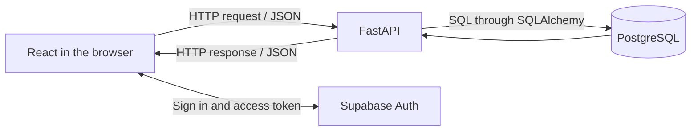

# Architecture Guide

This page is a map of the project, not a list of implementation steps. Follow the [learning roadmap](docs/todos.md) to build each part in order. The [PRD](PRD.md) defines what the finished MVP should do.

## The Main Request Path

The browser sends an HTTP request to FastAPI. FastAPI reads or changes data through SQLAlchemy, which sends SQL to PostgreSQL. FastAPI turns the result into JSON and sends an HTTP response back to the browser.



HTTP is how programs request data from each other. JSON is the text format used for request and response data. SQL is the language used to ask a database to read or change rows.

## What Exists Today

| Area | Current files | Current behavior |
| --- | --- | --- |
| API | `backend/src/backend/main.py` | FastAPI app, CORS settings, and `GET /health`. |
| Settings | `backend/src/backend/core/config.py` | Reads backend settings; uses local SQLite when `DATABASE_URL` is not set. |
| Database connection | `backend/src/backend/db/session.py` | Creates a SQLAlchemy engine and a session for database work. |
| Models | `backend/src/backend/db/base.py` | Empty base class for future table models. |
| Migrations | `backend/alembic/` | Alembic is configured; no course or registration migration exists yet. |
| Tests | `backend/tests/test_health.py` | Checks the health response and the derived JWKS URL. |
| Frontend | `frontend/src/App.tsx` | Vite demo; course-registration screens are not implemented. |

## Planned Data Model

| Table | Purpose | Main relationship |
| --- | --- | --- |
| `courses` | Describes a course, such as its name and credits. | One course has many classes. |
| `classes` | Describes a particular offering of a course, with a teacher, schedule, and capacity. | Each class belongs to one course. |
| `registrations` | Records that a user registered for a class. | Joins a Supabase user to a class. |
| `auth.users` | Supabase-managed user accounts. | One user can have many registrations. |

The app creates `courses`, `classes`, and `registrations`. Supabase owns `auth.users`. The backend stores the verified user's UUID in `registrations.user_id`; it does not map the Supabase users table as one of its own models.

The product requires one registration per user/class pair and requires `registered` to stay between zero and `capacity`. Database constraints should enforce these rules as part of the schema.

## Reading Classes

The first data flow to build is `GET /classes`:

1. React sends a `GET` request to FastAPI.
2. FastAPI asks SQLAlchemy to read class and course rows.
3. SQLAlchemy sends a query to PostgreSQL.
4. FastAPI returns the results as JSON with status `200`.
5. React displays the JSON data.

The endpoint is public, so this flow works before authentication is added. Try it with `curl` before connecting the frontend.

## Authentication Later

Supabase Auth handles sign-in and returns an access token to React. For a protected request, React sends the token in the `Authorization` header. FastAPI verifies the token before using its `sub` claim as the user's ID.

```text
Sign in: React <-> Supabase Auth
Data:    React --HTTP + token--> FastAPI --SQLAlchemy--> PostgreSQL
```

The database password and Supabase service-role key stay on the backend. The browser may use the Supabase anon/publishable key for Auth, but must not use it to query the app's tables directly.

This project plans to leave Row Level Security (RLS) disabled on its app tables because requests go through FastAPI. That means the API must always filter registrations by the verified user ID. If the frontend later accesses tables directly through Supabase, RLS policies must be added first.

## Small Design Choices

- **SQLite for the first local run:** it lets the API start without a Supabase project. The finished app uses PostgreSQL through Supabase.
- **Synchronous SQLAlchemy:** one request can read or write with straightforward Python functions; async database code is not needed for this learning project.
- **Alembic migrations:** migrations are versioned instructions for creating or changing database tables.
- **Supabase owns user accounts:** the app references user IDs but does not store passwords or create a competing user table.

More detailed requirements for JWT key handling, RLS, capacity races, database constraints, and production checks are in [Later Topics](docs/later-topics.md).