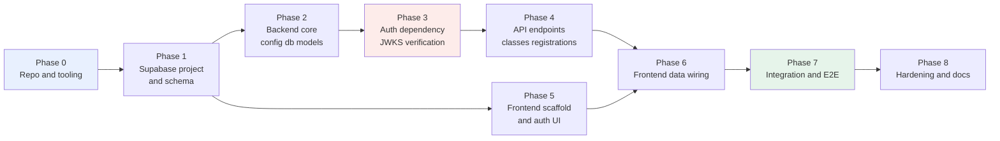

# Tasks — Course Registration App

Implementation plan derived from [`PRD.md`](../PRD.md), with technical decisions resolved in
[`architecture.md`](../architecture.md).

Setup guides in this folder: [`supabase-setup.md`](./supabase-setup.md) ·
[`backend-setup.md`](./backend-setup.md) · [`frontend-setup.md`](./frontend-setup.md).

**Scope.** Student register/drop only. Teacher/admin CRUD, roles, and course authorship are **not** in
this plan (see [Out of Scope](#out-of-scope)).

## How to use this file

* Tasks are grouped into phases; phase order is the dependency order.
* Each task has a stable ID, the **files** it touches, its **depends on** set, and **acceptance
  criteria** that are objectively checkable. A task is done only when every criterion holds.
* Tasks marked **RISK GATE** must pass before dependent work starts, because they can invalidate the
  technology choice rather than just fail a test.
* Every PRD §7 "Definition of Done" bullet maps to at least one task — see the
  [traceability table](#definition-of-done-traceability).

### Phase dependency graph

The two lanes matter: Phase 5 (frontend scaffold, auth UI) only needs Phase 1, so it can proceed in
parallel with Phases 2–4. Phases 2–4 are strictly sequential.

---

## Phase 0 — Repo and tooling

### T0.1 — Add a root `.gitignore`
**Files:** `.gitignore` (new)
**Depends on:** —
**Acceptance criteria:**
- [x] Excludes Python (`__pycache__/`, `*.py[cod]`, `.venv/`, `.pytest_cache/`), Node (`node_modules/`, `dist/`), and editor dirs (`.vscode/`, `.idea/`)
- [x] Excludes `.env` and `*.env` **except** `*.env.example`
- [x] Does **not** exclude `uv.lock` — the lockfile is committed (ADR-6). Verify it is absent from the ignore list
- [x] `git status --porcelain` shows no ignored file from a scratch `touch backend/.env`

### T0.2 — Commit example environment files
**Files:** `backend/.env.example` (new), `frontend/.env.example` (new)
**Depends on:** T0.1
**Acceptance criteria:**
- [x] Backend example lists `DATABASE_URL`, `SUPABASE_URL`, `SUPABASE_JWKS_URL`, `SUPABASE_JWT_AUDIENCE`, `SUPABASE_JWT_SECRET` (commented as legacy-only), `CORS_ORIGINS` — matching architecture.md §7.1
- [x] Frontend example lists `VITE_SUPABASE_URL`, `VITE_SUPABASE_ANON_KEY`, `VITE_API_BASE_URL`
- [x] Every value is an obvious placeholder, with no real project ref or key anywhere
- [x] Neither example file contains a variable with a secret value

### T0.3 — Declare backend dependencies and prove them on Python 3.14 — **RISK GATE**
**Files:** `backend/pyproject.toml`, `backend/uv.lock` (new)
**Depends on:** —
**Acceptance criteria:**
- [x] `backend/pyproject.toml` `dependencies` gains: `fastapi`, `uvicorn[standard]`, `sqlalchemy`, `pydantic-settings`, `psycopg[binary]`, `pyjwt[crypto]`, `alembic`; dev group gains `pytest`, `pytest-cov`, `httpx`, `ruff`
- [x] `uv sync` completes against Python 3.14 with wheels for `psycopg`, `cryptography` and `pydantic-core` — no source build from a missing wheel
- [x] `uv run python -c "import fastapi, sqlalchemy, psycopg, jwt, cryptography, alembic"` exits `0`
- [x] If any import fails: stop and resolve the interpreter version here, before any feature code exists. Record the outcome in `architecture.md` §9.2
- [x] `uv.lock` is generated and committed

### T0.4 — Scaffold the React frontend
**Files:** `frontend/` (new tree)
**Depends on:** T0.1
**Acceptance criteria:**
- [ ] Vite React + TypeScript project created in `frontend/` (not a subdirectory)
- [ ] `npm run dev` serves the app; `npm run build` succeeds with no TypeScript errors
- [ ] `@supabase/supabase-js` is a dependency; `package.json` scripts are `dev`, `build`, `preview`, `lint`
- [ ] `node_modules/` and `dist/` are gitignored (T0.1)

### T0.5 — Decide and document the dependency source of truth
**Files:** `architecture.md` (ADR-6 already records this), root `requirements.txt`
**Depends on:** T0.3
**Acceptance criteria:**
- [ ] ADR-6 in `architecture.md` matches what was actually done in T0.3
- [ ] The empty root `requirements.txt` is either deleted or left with a one-line comment pointing at `backend/pyproject.toml`
- [ ] No file tells a new contributor to `pip install -r requirements.txt`

---
## Phase 1 — Supabase project and database schema

### T1.1 — Create the Supabase project
**Files:** — (external state)
**Depends on:** —
**Acceptance criteria:**
- [ ] Project created and its region noted (pick the region closest to the FastAPI host — ADR-3 cites cross-region latency as the reason to avoid per-request Auth round-trips)
- [ ] Project ref, project URL, anon key and database connection string recorded somewhere private (not the repo)
- [ ] `frontend/.env` and `backend/.env` created locally from the `.env.example` files

### T1.2 — Determine the project's JWT signing key type — **RISK GATE**
**Files:** `backend/.env`
**Depends on:** T1.1
**Acceptance criteria:**
- [ ] Fetch `https://<project-ref>.supabase.co/auth/v1/.well-known/jwks.json` with the anon key. If it returns a key set, the project uses asymmetric keys and ADR-3's primary path applies
- [ ] Decode one real access token (sign in via the dashboard) and confirm the `alg` header is `ES256`/`RS256` *or* `HS256`
- [ ] Confirm the `iss` value equals `https://<project-ref>.supabase.co/auth/v1` and the `aud` value equals `authenticated`; write both into `backend/.env`
- [ ] If `alg` is `HS256`, choose ADR-3 alternative (a) or (b) and record the choice before writing `core/security.py`. Do **not** proceed to T3.1 with an unresolved algorithm

### T1.3 — Enable the auth providers
**Files:** — (external state)
**Depends on:** T1.1
**Acceptance criteria:**
- [ ] Email provider enabled; at least one test user created and confirmed
- [ ] Google OAuth enabled with the project's redirect URL allowlisted (PRD §6, Step 1)
- [ ] Site URL and redirect URLs include the local frontend origin (e.g. `http://localhost:5173`)
- [ ] Signing in with each provider yields a session with a non-empty `access_token`

### T1.4 — Introduce Alembic
**Files:** `backend/alembic.ini`, `backend/alembic/env.py`, `backend/alembic/versions/` (new)
**Depends on:** T0.3, T1.2
**Acceptance criteria:**
- [ ] `alembic init` run inside `backend/`; `env.py` imports `Base.metadata` from `backend.db.base` and reads `DATABASE_URL` from settings, not from a hardcoded `alembic.ini` URL
- [ ] `uv run alembic current` connects to the Supabase database and exits `0`
- [ ] The command is documented as "run from `backend/`" so it is reproducible

### T1.5 — Migration: three tables, constraints, and indexes
**Files:** `backend/alembic/versions/<rev>_initial_schema.py` (new)
**Depends on:** T1.4
**Acceptance criteria:**
- [ ] Creates `courses`, `classes`, `registrations` exactly as in architecture.md §3.4
- [ ] Includes `UNIQUE (user_id, class_id)` on `registrations`, `UNIQUE (class_code)` on `classes`, and `CHECK (registered >= 0 AND registered <= capacity)`
- [ ] `registrations.user_id` has a foreign key to `auth.users (id)` with `ON DELETE CASCADE`; `registrations.class_id` cascades; `classes.course_id` restricts
- [ ] Creates `ix_classes_course_id`, `ix_registrations_user_id`, `ix_registrations_class_id`
- [ ] The `gen_random_uuid()` default works (the `pgcrypto` extension is present, per ADR-1)
- [ ] `upgrade head`, then `downgrade base`, then `upgrade head` all succeed — the downgrade is real, not a stub
- [ ] **RLS is deliberately left disabled** on all three tables, and a comment in the migration says so with a pointer to ADR-2

### T1.6 — Seed data script
**Files:** `backend/scripts/seed.py` (new)
**Depends on:** T1.5
**Acceptance criteria:**
- [ ] Idempotent: running it twice does not duplicate rows (upsert by natural key, e.g. `class_code`)
- [ ] Creates at least 3 courses and at least 5 classes
- [ ] Includes one class with `capacity = 1, registered = 0` and one with `registered = capacity` — T7.5 and T7.6 depend on both existing
- [ ] `registered` values are consistent with the number of seeded registrations (zero), so the counter starts truthful

---
## Phase 2 — Backend core

Package root is `backend/src/backend/` (uv src-layout). T2.0 is a prerequisite for everything in this phase.

### T2.0 — Convert the placeholder package into an importable app package
**Files:** `backend/src/backend/__init__.py`, `backend/src/backend/main.py` (new)
**Depends on:** T0.3
**Acceptance criteria:**
- [ ] The `print("Hello from backend!")` placeholder in `__init__.py` is removed or replaced with a package docstring
- [ ] `main.py` defines `app = FastAPI(...)`, so the `backend:main` script entry in `pyproject.toml` resolves to a real ASGI app
- [ ] `uv run uvicorn backend.main:app --reload` starts and `GET /health` returns `200 {"status":"ok"}`
- [ ] `__init__.py` does **not** import `main`, avoiding a circular import between the package root and the app module

### T2.1 — Application settings
**Files:** `backend/src/backend/core/config.py` (new), `backend/src/backend/core/__init__.py` (new)
**Depends on:** T2.0, T0.2
**Acceptance criteria:**
- [ ] `Settings(BaseSettings)` exposes exactly the backend variables in architecture.md §7.1
- [ ] `model_config` reads `backend/.env`
- [ ] A cached `get_settings()` is exposed; nothing else reads `os.environ` directly
- [ ] `SUPABASE_JWKS_URL` defaults to `<SUPABASE_URL>/auth/v1/.well-known/jwks.json` when unset (the `iss` + `/.well-known/jwks.json` rule)
- [ ] Starting the app with a required variable missing fails loudly at startup, not at the first request

### T2.2 — Engine, session, and declarative base
**Files:** `backend/src/backend/db/base.py`, `backend/src/backend/db/session.py`, `backend/src/backend/db/__init__.py` (new)
**Depends on:** T2.1
**Acceptance criteria:**
- [ ] `Base(DeclarativeBase)` in `base.py`; `Base.metadata` is what Alembic's `env.py` targets (T1.4)
- [ ] `session.py` builds the engine from `Settings.database_url` with `pool_pre_ping=True`
- [ ] `get_db()` is a generator dependency that yields a `Session` and always closes it, including on exception
- [ ] Mapping style is SQLAlchemy 2.0 (`Mapped[...]`, `mapped_column(...)`) — no legacy `Column` declarations
- [ ] No live database connection is made at import time

### T2.3 — `Course` model and `Course` schemas
**Files:** `backend/src/backend/models/course.py`, `backend/src/backend/schemas/course.py`, plus the `models/` and `schemas/` `__init__.py` (new)
**Depends on:** T2.2
**Acceptance criteria:**
- [ ] `Course` maps `courses` with `id`, `name`, `credits` per PRD §3.1
- [ ] `CourseOut` is the read schema with `model_config = ConfigDict(from_attributes=True)`
- [ ] `alembic check` (or a fresh autogenerate diff) reports **no** schema difference against T1.5's migration — a diff here means model and migration have drifted

### T2.4 — `Class` model and schemas
**Files:** `backend/src/backend/models/class_.py`, `backend/src/backend/schemas/class_.py` (new)
**Depends on:** T2.3
**Acceptance criteria:**
- [ ] Module is named `class_.py` because `class` is a Python keyword; the mapped class is `ClassRecord`
- [ ] Maps all PRD §3.2 columns: `id`, `course_id`, `class_code`, `teacher`, `capacity`, `registered`, `tuition`, `schedule`
- [ ] `Course.classes` / `ClassRecord.course` are a `relationship()` pair matching matrix edge **R1** (1:N, `courses` → `classes`)
- [ ] `ClassOut` inlines a nested `CourseOut`, matching architecture.md §6.1
- [ ] No code path assigns `ClassRecord.registered` in Python — only SQL increments/decrements it (§3.6, ADR-4)

### T2.5 — `Registration` model and schemas
**Files:** `backend/src/backend/models/registration.py`, `backend/src/backend/schemas/registration.py` (new)
**Depends on:** T2.4
**Acceptance criteria:**
- [ ] Maps PRD §3.3: `id` (uuid), `user_id` (uuid), `class_id` (int), `created_at`
- [ ] `user_id` is a **plain `Mapped[uuid.UUID]` column with no `relationship()` and no counterpart model** — the `auth.users` boundary in architecture.md §3.5
- [ ] No `User`/`AuthUser` ORM class exists anywhere in the codebase
- [ ] `ClassRecord.registrations` is a `relationship()` matching matrix edge **R2** (1:N, `classes` → `registrations`)
- [ ] `RegistrationCreate` accepts **only** `class_id`; there is no `user_id` field a client could supply (architecture.md §7.3)
- [ ] `RegistrationOut` has `id`, `class_id`, `created_at`, and a nested `ClassOut` per architecture.md §6.1

---
## Phase 3 — Auth dependency (JWT verification)

### T3.1 — JWKS client with caching
**Files:** `backend/src/backend/core/security.py` (new)
**Depends on:** T2.1, T1.2
**Acceptance criteria:**
- [ ] A module-level `PyJWKClient(settings.supabase_jwks_url)` is created with key caching enabled
- [ ] The JWKS document is fetched **once** and reused — assert that a second `decode_token` call performs no network request (monkeypatch or inspect the underlying fetch)
- [ ] The client supports key rotation: if a token's `kid` is unknown, the cache is refreshed exactly once before failing
- [ ] Implemented per ADR-3. If T1.2 found `HS256`, this task implements the selected alternative instead, and the deviation is recorded

### T3.2 — `decode_token`
**Files:** `backend/src/backend/core/security.py`
**Depends on:** T3.1
**Acceptance criteria:**
- [ ] Resolves the signing key by `kid`, then calls `jwt.decode` with `algorithms` restricted to the expected set (never `algorithms=None`)
- [ ] Passes `audience=settings.supabase_jwt_audience` and `issuer=settings.supabase_url`, so both `aud` and `iss` are enforced (§2.2) — the `iss` check is what stops a token from a *different* Supabase project being accepted
- [ ] Verifies `exp` (PyJWT default) and requires the `exp` claim to be present
- [ ] Returns a typed `Claims` object exposing at least `sub: UUID`; a `sub` that is not a valid UUID raises rather than being coerced
- [ ] Raises a single project-specific `InvalidTokenError` for every failure mode, with a machine-readable `code` (`invalid_token`, `expired_token`) — no PyJWT exception types leak to the routers
- [ ] The raw token never appears in an exception or a log line (§7.4)

### T3.3 — `get_current_user` dependency
**Files:** `backend/src/backend/deps/auth.py`, `backend/src/backend/deps/__init__.py` (new)
**Depends on:** T3.2
**Acceptance criteria:**
- [ ] Uses `HTTPBearer(auto_error=False)` so a missing header yields *our* error shape, not FastAPI's default
- [ ] Missing header → `401` with `WWW-Authenticate: Bearer`; malformed/expired/badly-signed token → `401`; both use the envelope in architecture.md §6.2
- [ ] On success returns `AuthenticatedUser(id: UUID)` sourced **only** from the token's `sub` (§7.3) — never from a query param, header or body
- [ ] Adding the dependency to a route does not open a database session (token verification must not touch the DB)

### T3.4 — Auth unit tests
**Files:** `backend/tests/test_security.py` (new)
**Depends on:** T3.3
**Acceptance criteria:**
- [ ] Tests with a locally generated key pair and self-signed tokens (no network, no Supabase dependency) cover: valid token, expired token, wrong `aud`, wrong `iss`, bad signature, `alg: none` rejection, missing `sub`, non-UUID `sub`
- [ ] A valid token minted for a *different* project URL is rejected — the negative case behind §9.2's `iss`/`aud` risk
- [ ] All tests pass offline: `uv run pytest backend/tests/test_security.py` with networking disabled
- [ ] No test asserts that the raw token appears in an error message

---

## Phase 4 — API endpoints

### T4.1 — `GET /classes` (public)
**Files:** `backend/src/backend/api/v1/classes.py`, `backend/src/backend/api/__init__.py`, `backend/src/backend/api/v1/__init__.py` (new)
**Depends on:** T2.5
**Acceptance criteria:**
- [ ] Returns `200` with a list of `ClassOut`, each inlining its `course`, per architecture.md §6.1
- [ ] **No auth dependency** — anonymous callers succeed (PRD §7: "Unauthenticated users can view available classes")
- [ ] Exactly **one** query for the class list and **no** per-row lazy load: use `selectinload(ClassRecord.course)` (or an explicit join), and assert the query count via SQLAlchemy's event listener in a test
- [ ] Seeded classes all appear, ordered deterministically (e.g. by `class_code`) so the UI and tests stay stable
- [ ] Returns `200 []` on an empty table, not `404`

### T4.2 — `GET /registrations/me` (protected)
**Files:** `backend/src/backend/api/v1/registrations.py` (new)
**Depends on:** T3.3, T2.5
**Acceptance criteria:**
- [ ] Requires `Depends(get_current_user)`; a missing or invalid token gives `401`
- [ ] Filters by `Registration.user_id == current_user.id` — never returns another user's rows (with RLS off per ADR-2, this filter is the only thing preventing it)
- [ ] Returns `200` with `[RegistrationOut]`, each inlining its `class`
- [ ] Does **not** join `auth.users`; no email is returned (§3.5)
- [ ] An authenticated user with no registrations gets `200 []`, not an error

### T4.3 — `register` in the service layer
**Files:** `backend/src/backend/services/registration_service.py`, `backend/src/backend/services/__init__.py` (new)
**Depends on:** T2.5
**Acceptance criteria:**
- [ ] `register(session, user_id, class_id) -> Registration` implements architecture.md §3.6 **exactly**: lock the class row, then check capacity, then insert, then increment
- [ ] The class row is fetched with `with_for_update()`; a test asserts the compiled statement contains the lock clause
- [ ] Class missing → `ClassNotFoundError` (→ `404`); `registered >= capacity` → `ClassFullError` (→ `409`); duplicate → `AlreadyRegisteredError` (→ `409`)
- [ ] The duplicate case is caught from the **unique-constraint violation** (`IntegrityError`) and translated, not pre-checked with a racy `SELECT`
- [ ] On any error the transaction is rolled back, leaving both tables unchanged — a test asserts `registered` is unmoved after a rejected request
- [ ] `registered` is incremented with an SQL expression (`registered + 1`), never `class_.registered + 1` in Python (ADR-4)
- [ ] `user_id` comes from the function argument only; the service cannot accept it from a request body
- [ ] The service does not import `fastapi` — it raises domain errors, so it is testable without an HTTP client

---
### T4.4 — `POST /registrations`
**Files:** `backend/src/backend/api/v1/registrations.py`
**Depends on:** T4.3
**Acceptance criteria:**
- [ ] Body is `{"class_id": 1}` per PRD §4; a body that also contains `user_id` has that field silently ignored (the field does not exist on `RegistrationCreate`)
- [ ] Returns `201` with `RegistrationOut`
- [ ] Maps domain errors to the codes in architecture.md §6: `404 class_not_found`, `409 class_full`, `409 already_registered`
- [ ] A malformed body returns `422` in FastAPI's default validation shape
- [ ] The router contains no SQL and no capacity logic — it only wires the dependency, the service and the schema

### T4.5 — `unregister` and `DELETE /registrations/{class_id}`
**Files:** `backend/src/backend/services/registration_service.py`, `backend/src/backend/api/v1/registrations.py`
**Depends on:** T4.4
**Acceptance criteria:**
- [ ] `unregister(session, user_id, class_id)` deletes only rows matching **both** `user_id` and `class_id`, and decrements `registered` only when a row was actually deleted
- [ ] No matching row → `404 registration_not_found`; deleting another user's registration is impossible by construction (the `user_id` predicate) — verified by a two-user test
- [ ] `204` with an empty body on success
- [ ] After a drop, `registered` decreases by exactly 1 and `CHECK (registered >= 0)` is never violated; dropping twice returns `404` the second time and leaves the counter unchanged

### T4.6 — Error envelope and exception handlers
**Files:** `backend/src/backend/core/errors.py`, `backend/src/backend/main.py`
**Depends on:** T4.4
**Acceptance criteria:**
- [ ] Every domain error renders `{"detail": ..., "code": ...}` per architecture.md §6.2, with exactly the `code` strings listed there
- [ ] `InvalidTokenError` → `401` with `WWW-Authenticate: Bearer`, handled centrally so no router repeats it
- [ ] An unhandled exception returns `500` with `code: internal_error` and **no** traceback or SQL text in the body
- [ ] `422` retains FastAPI's nested `detail` shape
- [ ] Handlers are registered in `main.py` via `add_exception_handler`, not per-route `try/except`

### T4.7 — CORS middleware
**Files:** `backend/src/backend/main.py`
**Depends on:** T4.1
**Acceptance criteria:**
- [ ] `CORSMiddleware` added with `allow_origins=settings.cors_origins` (explicit list — **never** `["*"]` together with `allow_credentials`)
- [ ] `allow_headers` includes `Authorization` and `Content-Type`; omitting `Authorization` is the §9.2 CORS risk
- [ ] `allow_methods` covers `GET`, `POST`, `DELETE`, `OPTIONS`
- [ ] A preflight `OPTIONS` request with `Origin` and `Access-Control-Request-Headers: authorization` returns `200` with the matching `Access-Control-Allow-*` headers

---
## Phase 5 — Frontend scaffold and auth UI

Phase 5 depends only on Phase 1 (T1.1, T1.3) and can run in parallel with Phases 2–4.

### T5.1 — Supabase client singleton
**Files:** `frontend/src/lib/supabase.ts` (new)
**Depends on:** T0.4, T1.3
**Acceptance criteria:**
- [ ] Exports exactly one `createClient` instance, built from `import.meta.env.VITE_SUPABASE_URL` and `VITE_SUPABASE_ANON_KEY`
- [ ] `persistSession` is left at its default `true`, so the session survives a reload
- [ ] Startup throws a clear error if either variable is missing, instead of creating a client that fails mysteriously on first call
- [ ] Only `VITE_`-prefixed variables are referenced; no backend secret is imported here (§7.1)

### T5.2 — Auth context
**Files:** `frontend/src/context/AuthContext.tsx` (new)
**Depends on:** T5.1
**Acceptance criteria:**
- [ ] On mount, reads the existing session via `supabase.auth.getSession()`
- [ ] Subscribes to `supabase.auth.onAuthStateChange` and **unsubscribes on unmount** (a missing cleanup leaks a listener on every hot reload)
- [ ] Exposes `{ session, user, loading, signInWithOAuth, signInWithPassword, signOut }`
- [ ] `signOut` clears the session *and* any cached registration state, so a re-login does not show the previous user's rows
- [ ] A `useAuth()` hook throws if used outside the provider, so misuse fails loudly
- [ ] `loading` is `true` until the initial `getSession()` resolves — this is what prevents the "logged out flash" on refresh

### T5.3 — Navbar
**Files:** `frontend/src/components/Navbar.tsx` (new)
**Depends on:** T5.2
**Acceptance criteria:**
- [ ] Renders "Sign in" (Google + Email) when signed out, and the user's email + "Sign out" when signed in
- [ ] Reflects auth state changes without a manual reload (driven by context, not by local state)
- [ ] PRD §6 Step 1 is satisfied: clicking the Google button starts `signInWithOAuth({ provider: 'google' })`
- [ ] Shows nothing misleading while `loading` is `true`

### T5.4 — `App` shell
**Files:** `frontend/src/App.tsx`, `frontend/src/main.tsx` (modified)
**Depends on:** T5.3
**Acceptance criteria:**
- [ ] `main.tsx` renders `AuthProvider` above `App` (and any query provider added in T6.1)
- [ ] `App` composes `Navbar`, `ClassList` and `MyRegistrations` as separate components — the structure in PRD §5
- [ ] `ClassList` is rendered for **anonymous and authenticated** users; `MyRegistrations` only for authenticated users (or shows a sign-in prompt)
- [ ] No auth logic lives in `App` itself; it reads from `useAuth()`

### T5.5 — Frontend environment wiring
**Files:** `frontend/.env` (local, gitignored), `frontend/.env.example` (from T0.2)
**Depends on:** T5.1
**Acceptance criteria:**
- [ ] `npm run dev` starts with the real Supabase URL and anon key and logs no missing-variable error
- [ ] Signing in with Email and with Google both succeed end to end, and the email appears in the Navbar
- [ ] A hard reload preserves the session (no re-login)
- [ ] `git status` confirms `frontend/.env` is **not** tracked

### T5.6 — Auth state tests
**Files:** `frontend/src/context/AuthContext.test.tsx` (new)
**Depends on:** T5.2
**Acceptance criteria:**
- [ ] The Supabase client is mocked — no real network, no real project
- [ ] Asserts the listener is registered on mount and removed on unmount
- [ ] Asserts `loading` transitions from `true` to `false` after the initial session resolves
- [ ] Asserts `user` updates when the mocked `onAuthStateChange` fires `SIGNED_IN` then `SIGNED_OUT`

---
## Phase 6 — Frontend data wiring

### T6.1 — API client wrapper
**Files:** `frontend/src/lib/api.ts` (new)
**Depends on:** T5.2
**Acceptance criteria:**
- [ ] `apiFetch(path, init)` prepends `VITE_API_BASE_URL`, sets `Content-Type: application/json`, and attaches `Authorization: Bearer <access_token>` whenever a session exists
- [ ] The token is read fresh from the Supabase session on every call — never captured once in a module constant, which would go stale after a refresh
- [ ] On `401`: calls `supabase.auth.refreshSession()` **once**, retries the request once, and on a second `401` signs the user out and surfaces an auth error (§2.3)
- [ ] It does **not** retry on `409`, `404` or `422` — these are business outcomes, not transport failures
- [ ] Non-2xx responses are parsed into the error envelope (§6.2) and thrown as a typed error carrying `status`, `code` and `detail`
- [ ] Network failures throw a distinguishable error so the UI can say "cannot reach the server" rather than "invalid request"

### T6.2 — `useClasses` hook
**Files:** `frontend/src/hooks/useClasses.ts` (new)
**Depends on:** T6.1
**Acceptance criteria:**
- [ ] Calls `GET /classes` and returns typed `Class` objects matching architecture.md §6.1
- [ ] Works with **no session** — it must not wait for auth, because anonymous browsing is a PRD requirement
- [ ] Exposes `{ data, loading, error, refetch }`
- [ ] `refetch` is stable across renders (wrapped in `useCallback` or equivalent) so it is safe in a dependency array

### T6.3 — `ClassList` and `ClassCard`
**Files:** `frontend/src/components/ClassList.tsx`, `frontend/src/components/ClassCard.tsx` (new)
**Depends on:** T6.2
**Acceptance criteria:**
- [ ] Renders each class's course name, `class_code`, teacher, schedule, credits and `tuition`
- [ ] Shows availability as `registered / capacity` and marks a full class (`registered >= capacity`) as unavailable with "Register" disabled
- [ ] "Register" is disabled for anonymous users with an explanatory prompt, not a silent no-op
- [ ] All four states are handled: loading, empty ("no classes available"), error (with retry calling `refetch`), populated
- [ ] Clicking "Register" calls `POST /registrations` and, on success, refreshes both the class list and the user's registrations so the two views never disagree
- [ ] A `409` shows the specific reason ("class is full" / "already registered") from the error envelope's `code`, not a generic failure message

### T6.4 — `useMyRegistrations` hook
**Files:** `frontend/src/hooks/useMyRegistrations.ts` (new)
**Depends on:** T6.1
**Acceptance criteria:**
- [ ] Calls `GET /registrations/me` only when a session exists; it must not fire while signed out
- [ ] Re-fetches automatically when the user changes (logging in as a different user does not show the previous user's rows)
- [ ] Returns typed `Registration` objects matching architecture.md §6.1
- [ ] Exposes `{ data, loading, error, refetch }`

### T6.5 — `MyRegistrations` and `RegistrationRow`
**Files:** `frontend/src/components/MyRegistrations.tsx`, `frontend/src/components/RegistrationRow.tsx` (new)
**Depends on:** T6.4
**Acceptance criteria:**
- [ ] Signed out → a sign-in prompt instead of an empty table
- [ ] Signed in with no registrations → an explicit "you have not registered for any classes" empty state, distinct from the signed-out state
- [ ] Each row shows the class details and a "Drop" button
- [ ] "Drop" calls `DELETE /registrations/{class_id}` and, on `204`, refreshes both this list and the class list (the capacity display must update)
- [ ] A `404` drop (already removed elsewhere) refreshes the list rather than showing a scary error
- [ ] Every row has a stable `key` (the registration `id`), not the array index

### T6.6 — Cross-view consistency and edge cases
**Files:** `frontend/src/components/ClassList.tsx`, `frontend/src/components/MyRegistrations.tsx`, `frontend/src/hooks/*`
**Depends on:** T6.3, T6.5
**Acceptance criteria:**
- [ ] After a successful register or drop, `registered / capacity` in `ClassList` reflects the new value without a page reload
- [ ] "Register" on a class the user is already in shows "already registered" rather than allowing a duplicate click
- [ ] Rapid double-clicking "Register" issues one request, or the second is absorbed by the `409 already_registered` path — verify no duplicate row is created
- [ ] The UI stays correct if the user signs out while a request is in flight (no state update onto an unmounted or other-user view)
- [ ] An expired access token mid-click silently refreshes and completes the action instead of erroring (§2.3)

---
## Phase 7 — Integration and end-to-end verification

These tasks exercise the *assembled* system against a real Supabase project with a real signed-in user.
They are the primary evidence for the PRD §7 Definition of Done.

### T7.1 — CORS preflight from the browser
**Depends on:** T4.7, T5.5
**Acceptance criteria:**
- [ ] Dev server on `http://localhost:5173` calls `http://localhost:8000/classes` with no CORS error in the console
- [ ] The browser network tab shows the `OPTIONS` preflight returning `200` with `Access-Control-Allow-Headers` containing `authorization`
- [ ] An origin *not* in `CORS_ORIGINS` is rejected — proving the allowlist is load-bearing, not cosmetic

### T7.2 — Anonymous access rules (PRD DoD)
**Depends on:** T4.1, T4.2, T5.4
**Acceptance criteria:**
- [ ] **Signed out**, the class catalog renders with real data (PRD §7: "Unauthenticated users can view available classes")
- [ ] **Signed out**, `GET /registrations/me` returns `401` and the UI shows a sign-in prompt rather than an error banner
- [ ] **Signed out**, clicking "Register" does not send a request
- [ ] A direct `curl` to `POST /registrations` with no `Authorization` header returns `401` with a `WWW-Authenticate: Bearer` response header

### T7.3 — Registration persists against the correct user (PRD DoD, critical)
**Depends on:** T4.4, T6.3
**Acceptance criteria:**
- [ ] Signed in, clicking "Register" returns `201` and the class appears in "My Registrations" without a reload
- [ ] `SELECT * FROM registrations WHERE user_id = '<the signed-in user id>'` shows the new row, and that `user_id` **equals the `sub` claim** of that user's access token
- [ ] The same `user_id` equals `auth.users.id` for that user (verified in the Supabase SQL editor) — the literal requirement in PRD §7's last bullet
- [ ] `classes.registered` for that class increased by exactly 1
- [ ] Signing in as a **second** user and registering for the same class creates a *separate* row; neither user sees the other's registration in `GET /registrations/me`
- [ ] `created_at` is populated by the database default (not sent by the client)

### T7.4 — Unregister (PRD DoD)
**Depends on:** T4.5, T6.5
**Acceptance criteria:**
- [ ] Clicking "Drop" returns `204`, removes the row, and the class disappears from "My Registrations"
- [ ] `classes.registered` decreased by exactly 1 and the catalog's `registered / capacity` reflects it without a reload
- [ ] The row is gone from the database, not soft-deleted
- [ ] `DELETE /registrations/{class_id}` for a class the user is **not** registered for returns `404`
- [ ] User A cannot delete user B's registration: calling with A's token and B's `class_id` returns `404` and B's row is untouched

### T7.5 — Capacity enforcement
**Depends on:** T1.6, T4.3
**Acceptance criteria:**
- [ ] Registering for the seeded `capacity = 1` class succeeds for the first user and sets `registered` to 1
- [ ] A second user's attempt returns `409 class_full` and **does not** create a row or change the counter
- [ ] The UI disables "Register" and marks the class full once `registered >= capacity`
- [ ] Fire two concurrent registrations at the same single-seat class (two parallel `curl`s or a small script): exactly one returns `201`, the other `409`, and `registered` ends at exactly 1 — this is what proves the §3.6 row lock and the `CHECK` constraint work

### T7.6 — Duplicate registration rejected
**Depends on:** T4.3
**Acceptance criteria:**
- [ ] Registering twice for the same class returns `409 already_registered` on the second attempt
- [ ] Exactly one row exists in `registrations` for that `(user_id, class_id)` pair
- [ ] `classes.registered` did **not** increment on the rejected second attempt — proving the rollback in T4.3 works
- [ ] The constraint name in the database error is `registrations_user_class_unique`, confirming the unique constraint (not application code) is what rejected it

### T7.7 — Token expiry and refresh
**Depends on:** T6.1
**Acceptance criteria:**
- [ ] With a short access-token lifetime, waiting for expiry and then clicking "Register" completes with no user-visible error
- [ ] The network tab shows the original `401`, a refresh call, and a successful retry
- [ ] If the *refresh token* is also invalid (session revoked via the Supabase dashboard), the app signs the user out and shows a sign-in prompt instead of looping
- [ ] No infinite retry loop occurs — at most one retry per request

### T7.8 — Data integrity after the full cycle
**Depends on:** T7.3, T7.4
**Acceptance criteria:**
- [ ] Running register → drop → register for the same class leaves exactly one row and a correct counter
- [ ] For every seeded class, `classes.registered` equals `SELECT count(*) FROM registrations WHERE class_id = <id>` — no drift after the whole E2E run
- [ ] A query for `CHECK (registered >= 0 AND registered <= capacity)` violations returns zero rows

---
## Phase 8 — Hardening and documentation

### T8.1 — Backend service tests
**Files:** `backend/tests/test_registration_service.py` (new)
**Depends on:** T4.5, T7.8
**Acceptance criteria:**
- [ ] Covers: successful register, capacity full, duplicate register, unknown class, successful drop, drop when not registered
- [ ] A test asserts that after a rejected register the `classes.registered` value is **unchanged** (rollback verified)
- [ ] A test asserts `registered` equals `COUNT(*)` before and after a register/drop cycle — the §9.2 drift mitigation
- [ ] The service is called directly with a session, no HTTP client involved, proving the layering in architecture.md §4.2
- [ ] `uv run pytest` passes with no network access required

### T8.2 — Backend API tests
**Files:** `backend/tests/test_api_registrations.py` (new)
**Depends on:** T4.6
**Acceptance criteria:**
- [ ] `TestClient` with an overridden `get_current_user` dependency, so no real token is needed for happy paths
- [ ] Asserts `GET /classes` works with **no** auth override at all (the public route)
- [ ] Asserts every error code in architecture.md §6.2 is produced by the right trigger: `invalid_token`, `class_not_found`, `class_full`, `already_registered`, `registration_not_found`
- [ ] Asserts a `409` body matches the `{"detail", "code"}` envelope exactly
- [ ] Asserts `POST /registrations` with a body containing `user_id` does not create a row for that user (the §7.3 injection case)

### T8.3 — Developer setup documentation
**Files:** `README.md` (revised)
**Depends on:** T7.8
**Acceptance criteria:**
- [ ] Documents prerequisites, `uv sync`, `alembic upgrade head`, the seed script, and `npm install && npm run dev`
- [ ] Lists every environment variable for both apps with a pointer to the `.env.example` files
- [ ] Includes the exact commands to run both test suites
- [ ] States the scope explicitly (student register/drop) so the README no longer implies teacher CRUD — closing the architecture.md §9.1 divergence
- [ ] A reader can go from a clean clone to a working local app by following it top to bottom, with no undocumented steps

### T8.4 — Documentation and decision sync
**Files:** `architecture.md`, `docs/todos.md`, `PRD.md`
**Depends on:** all phases
**Acceptance criteria:**
- [ ] Every ADR in `architecture.md` §8 reflects what was actually built, including any deviation forced by T1.2 (JWT algorithm) or T0.3 (interpreter/wheels)
- [ ] The §9.2 risk table is updated with what actually happened for each risk
- [ ] Every mermaid block still renders — no diagram describes a structure abandoned mid-implementation
- [ ] Checkboxes in this file are ticked only where the acceptance criteria genuinely hold
- [ ] Any PRD change made during implementation is reflected back into `PRD.md` so all three documents agree

---

## Definition of Done traceability

Every bullet in PRD §7 maps to the tasks that prove it. Nothing in the PRD is orphaned.

| PRD §7 Definition of Done | Proven by |
| :--- | :--- |
| Supabase Auth configured (Email or OAuth) | **T1.3**, **T5.5** |
| React app handles login/logout states cleanly using the Supabase client | **T5.2**, **T5.3**, **T5.4**, **T5.6** |
| FastAPI backend verifies incoming Supabase JWT tokens | **T1.2**, **T3.1**, **T3.2**, **T3.3**, **T3.4**, **T7.2** |
| Unauthenticated users can view available classes | **T4.1**, **T6.2**, **T7.2** |
| Authenticated users can register/unregister for classes | **T4.4**, **T4.5**, **T6.3**, **T6.5**, **T7.3**, **T7.4** |
| Registrations persist in Supabase PostgreSQL tied to the specific user's `auth.users.id` | **T1.5**, **T2.5**, **T4.3**, **T7.3** |

Supporting requirements and where they are verified:

| Requirement | Source | Proven by |
| :--- | :--- | :--- |
| `GET /classes` returns course info with each class | PRD §4 | T4.1, T6.3 |
| `POST /registrations` payload is `{"class_id": 1}` only | PRD §4 | T4.4, T8.2 |
| Capacity check `registered < capacity` before insert | PRD §6 Step 3 | T4.3, T7.5 |
| `registered` incremented on register | PRD §6 Step 3 | T4.3, T7.3, T7.8 |
| Transaction committed before returning `201 Created` | PRD §6 Step 3 | T4.3, T4.4, T7.6 |
| Table relationships and cardinality | architecture.md §3.1–3.2 | T1.5, T2.3, T2.4, T2.5 |
| `auth.users` boundary respected (no ORM model) | architecture.md §3.5 | T2.5 |

---

## Out of scope

Confirmed with the project owner: this plan covers the **student register/drop flow only**. The following
are deliberately absent, and no task above should be read as implying them (see architecture.md §9.1 for
the full list and rationale):

* Teacher/admin CRUD for courses and classes
* Any role or permission model (`profiles` table, `role` claim)
* Course ownership / `courses.teacher_id`
* Pagination, search or filtering on `/classes`
* Registration history or audit trail
* Payment handling for `classes.tuition`

Recording these as out of scope is the point: it keeps the two documents honest about what the diagrams
and task list do and do not cover.